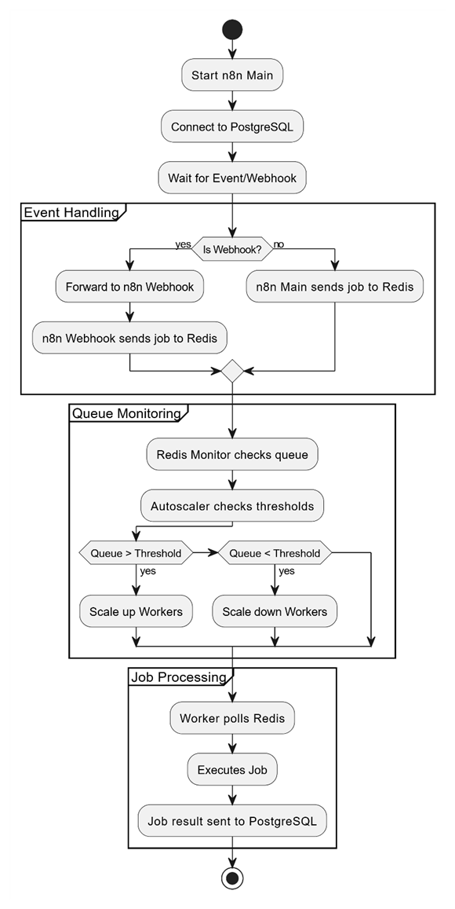
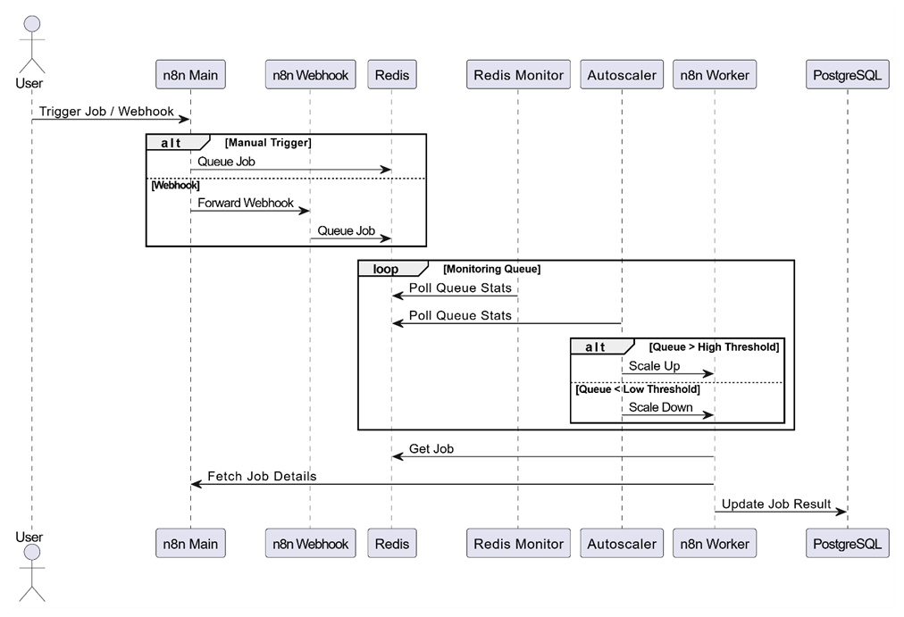
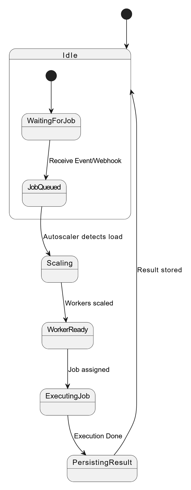

<!DOCTYPE html>
<html lang="en">
<head>
  <meta charset="UTF-8" />
  <meta name="viewport" content="width=device-width, initial-scale=1.0"/>
  <title>Scaling n8n - GitHub README</title>
  <style>
    body { font-family: Arial, sans-serif; line-height: 1.6; padding: 20px; background-color: #f9f9f9; }
    h1, h2, h3 { color: #2c3e50; }
    img { max-width: 100%; border: 1px solid #ccc; margin: 20px 0; }
    code { background: #eee; padding: 2px 4px; border-radius: 4px; }
  </style>
</head>
<body>

<h1>🚀 Scaling n8n with Docker Compose</h1>

<p>This repository contains a <strong>scalable, resilient</strong> Docker-based architecture for <a href="https://n8n.io">n8n</a> – an open-source workflow automation platform. It includes autoscaling workers, webhook separation, Redis queueing, and PostgreSQL persistence.</p>

<p>GitHub Repository: <a href="https://github.com/khamzatMurj/Scaling-n8n">github.com/khamzatMurj/Scaling-n8n</a></p>

<h2>📌 Architecture Overview</h2>

<p>This project enables scalable performance for n8n by separating responsibilities across multiple services. Here's how the system works:</p>

<ul>
  <li><strong>PostgreSQL:</strong> Stores all persistent data (workflows, executions, users).</li>
  <li><strong>n8n Main:</strong> Core service managing workflow logic, database access, and job delegation.</li>
  <li><strong>Redis:</strong> Queues jobs and allows decoupled execution through workers.</li>
  <li><strong>n8n Webhook:</strong> A lightweight instance for handling fast webhook responses without blocking.</li>
  <li><strong>n8n Workers:</strong> Scalable instances that process jobs asynchronously from the Redis queue.</li>
  <li><strong>n8n Autoscaler:</strong> Monitors queue length and scales workers accordingly.</li>
  <li><strong>Redis Monitor:</strong> Visualizes queue statistics and metrics for debugging or optimization.</li>
</ul>

<h2>🧠 Key Design Principles</h2>

<ul>
  <li><strong>Queue Mode Execution:</strong> Uses Redis to asynchronously execute workflows via dedicated workers.</li>
  <li><strong>Autoscaling:</strong> Worker containers scale up/down depending on job load.</li>
  <li><strong>Separation of Concerns:</strong> Webhooks and job processing are delegated to distinct containers.</li>
  <li><strong>Health Checks:</strong> Each service exposes a health endpoint to detect failure or overload.</li>
  <li><strong>Secure Networking:</strong> Uses Docker Compose networks for isolated service communication.</li>
</ul>

<h2>🖼️ Architecture Diagrams</h2>

<h3>1. Activity Diagram</h3>
<p>This diagram shows the high-level logic of how the system components interact dynamically.</p>


<h3>2. Sequence Diagram</h3>
<p>This illustrates the lifecycle of a workflow execution from webhook trigger to worker processing.</p>


<h3>3. State Transition Diagram</h3>
<p>Describes the states a job goes through (e.g., pending, running, completed, failed).</p>


<hr/>

## 📦 Gestion de Redis et des Workers n8n

### Voici comment accéder au conteneur Redis et voir la queue :

## **1. Entrer dans le conteneur Redis**

```bash
# Entrer dans le conteneur Redis
docker exec -it n8n-redis redis-cli
```

## **2. Commandes Redis utiles pour voir la queue**

### **Lister toutes les clés :**
```bash
# Dans redis-cli
KEYS *
```

### **Voir les queues n8n spécifiques :**
```bash
# Queues principales de n8n
KEYS bull:*
KEYS n8n:*
```

### **Voir le contenu d'une queue :**
```bash
# Lister les jobs dans une queue (exemple)
LRANGE bull:jobs:waiting 0 -1
LRANGE bull:jobs:active 0 -1
LRANGE bull:jobs:completed 0 -1
LRANGE bull:jobs:failed 0 -1
```

### **Statistiques des queues :**
```bash
# Longueur des queues
LLEN bull:jobs:waiting
LLEN bull:jobs:active
LLEN bull:jobs:completed
LLEN bull:jobs:failed
```

## **3. Commandes Redis générales utiles**

### **Info générale :**
```bash
INFO
INFO memory
INFO stats
```

### **Monitoring en temps réel :**
```bash
MONITOR
```

### **Voir toutes les bases de données :**
```bash
INFO keyspace
```

## **4. Script pour monitoring continu**

```bash
# Sortir du redis-cli d'abord (CTRL+D)
# Puis lancer ce script bash
docker exec -it n8n-redis redis-cli --eval - <<'EOF'
while true do
  redis.call('echo', 'Queue Status:')
  redis.call('echo', 'Waiting: ' .. redis.call('llen', 'bull:jobs:waiting'))
  redis.call('echo', 'Active: ' .. redis.call('llen', 'bull:jobs:active'))
  redis.call('echo', 'Completed: ' .. redis.call('llen', 'bull:jobs:completed'))
  redis.call('echo', 'Failed: ' .. redis.call('llen', 'bull:jobs:failed'))
  redis.call('echo', '---')
end
EOF
```

## **5. Alternative : Redis GUI**

Tu peux aussi utiliser Redis Desktop Manager ou RedisInsight :
```bash
# RedisInsight (interface web)
docker run -d --name redisinsight -p 8001:8001 redislabs/redisinsight:latest
# Puis va sur http://localhost:8001
```

## **6. Commandes spécifiques pour n8n**

### **Voir les jobs n8n :**
```bash
# Dans redis-cli
KEYS bull:n8n:*
SCAN 0 MATCH bull:n8n:*
```

### **Détails d'un job spécifique :**
```bash
# Remplace JOB_ID par l'ID réel
HGETALL bull:n8n:JOB_ID
```

## **Test pratique :**

1. **Ouvre Redis CLI :**
   ```bash
   docker exec -it n8n-redis redis-cli
   ```

2. **Teste ton webhook** (dans un autre terminal) :
   ```bash
   curl -X POST http://localhost:5678/webhook-test/1cbaaff4-0178-4f97-ae79-227f406fc3ce \
     -H "Content-Type: application/json" \
     -d '{"test": "data"}'
   ```

3. **Reviens dans Redis CLI** et vérifie :
   ```bash
   KEYS bull:*
   LLEN bull:jobs:waiting
   LLEN bull:jobs:active
   ```

Tu devrais voir les jobs apparaître et disparaître quand ils sont traités !

---

## 🚀 Gestion des Workers n8n (ajouter, supprimer, scaler)

Oui, absolument ! Tu peux lancer des workers supplémentaires avec CLI même si les autres conteneurs sont déjà démarrés. Voici plusieurs méthodes :

### **1. Méthode Docker Compose Scale (Recommandée)**

```bash
# Scaler le service worker existant à 3 instances
docker-compose up -d --scale n8n-worker=3

# Ou si ton service s'appelle différemment
docker-compose up -d --scale n8n-autoscaling-n8n-worker=3
```

### **2. Lancer un worker manuel avec Docker CLI**

```bash
# Lancer un worker supplémentaire manuellement
docker run -d \
  --name n8n-worker-manual \
  --network n8n-autoscaling_n8n-network \
  -e N8N_DIAGNOSTICS_ENABLED=true \
  -e N8N_USER_FOLDER=/n8n \
  -e N8N_ENCRYPTION_KEY=your_encryption_key \
  -e EXECUTIONS_MODE=queue \
  -e QUEUE_BULL_REDIS_HOST=n8n-redis \
  -e QUEUE_HEALTH_CHECK_ACTIVE=true \
  -e DB_TYPE=postgresdb \
  -e DB_POSTGRESDB_HOST=n8n-postgres \
  -e DB_POSTGRESDB_DATABASE=n8n \
  -e DB_POSTGRESDB_USER=n8n \
  -e DB_POSTGRESDB_PASSWORD=your_password \
  n8n-autoscaling-n8n-worker \
  sh /worker
```

### **3. Ajouter un service temporaire**

```bash
# Créer un docker-compose.override.yml
cat > docker-compose.override.yml << 'EOF'
version: '3.8'
services:
  n8n-worker-temp:
    build:
      context: .
      dockerfile: Dockerfile
    user: root:root
    restart: unless-stopped
    command: sh /worker
    environment:
      - N8N_DIAGNOSTICS_ENABLED=${N8N_DIAGNOSTICS_ENABLED}
      - N8N_USER_FOLDER=${N8N_USER_FOLDER}
      - N8N_ENCRYPTION_KEY=${N8N_ENCRYPTION_KEY}
      - EXECUTIONS_MODE=${EXECUTIONS_MODE}
      - QUEUE_BULL_REDIS_HOST=${QUEUE_BULL_REDIS_HOST}
      - QUEUE_HEALTH_CHECK_ACTIVE=${QUEUE_HEALTH_CHECK_ACTIVE}
      - DB_TYPE=${DB_TYPE}
      - DB_POSTGRESDB_HOST=${POSTGRES_HOST}
      - DB_POSTGRESDB_DATABASE=${POSTGRES_DB}
      - DB_POSTGRESDB_USER=${POSTGRES_USER}
      - DB_POSTGRESDB_PASSWORD=${POSTGRES_PASSWORD}
      - N8N_TASK_BROKER_URL=${N8N_TASK_BROKER_URL}
      - N8N_COMMAND_RESPONSE_URL=${N8N_COMMAND_RESPONSE_URL}
      - N8N_RUNNERS_AUTH_TOKEN=${N8N_RUNNERS_AUTH_TOKEN}
    volumes:
      - n8n_worker_temp:/n8n
    networks:
      - n8n-network

volumes:
  n8n_worker_temp:
EOF

# Lancer le nouveau worker
docker-compose up -d n8n-worker-temp
```

### **4. Vérifier les workers actifs**

```bash
# Voir tous les conteneurs
docker ps

# Voir spécifiquement les workers
docker ps --filter "name=worker"

# Voir les logs des workers
docker logs -f n8n-autoscaling-n8n-worker-1
```

### **5. Méthode la plus simple (Scale)**

```bash
# Voir le nom exact de ton service worker
docker-compose ps

# Scaler à 3 workers (exemple)
docker-compose up -d --scale n8n-worker=3
```

### **6. Tester la distribution**

```bash
# Envoyer plusieurs requêtes pour tester
for i in {1..5}; do
  curl -X POST http://localhost:5678/webhook-test/1cbaaff4-0178-4f97-ae79-227f406fc3ce \
    -H "Content-Type: application/json" \
    -d "{\"job\": $i}" &
done
wait

# Vérifier les logs de chaque worker
docker logs n8n-autoscaling-n8n-worker-1 --tail 10
docker logs n8n-autoscaling-n8n-worker-2 --tail 10  # si il existe
```

### **7. Supprimer un worker**

```bash
# Reduire le nombre de workers
docker-compose up -d --scale n8n-worker=1

# Ou supprimer un worker spécifique
docker stop n8n-worker-manual
docker rm n8n-worker-manual
```

### **Commande recommandée :**

```bash
# La plus simple et sûre
docker-compose up -d --scale n8n-worker=2
```

Cette commande va :
- Garder tous les autres services intacts
- Ajouter un worker supplémentaire
- Utiliser la même configuration que le worker existant

**Teste cette commande et dis-moi ce que tu vois avec `docker ps` !**
